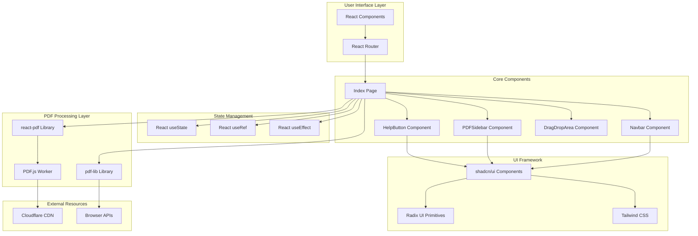
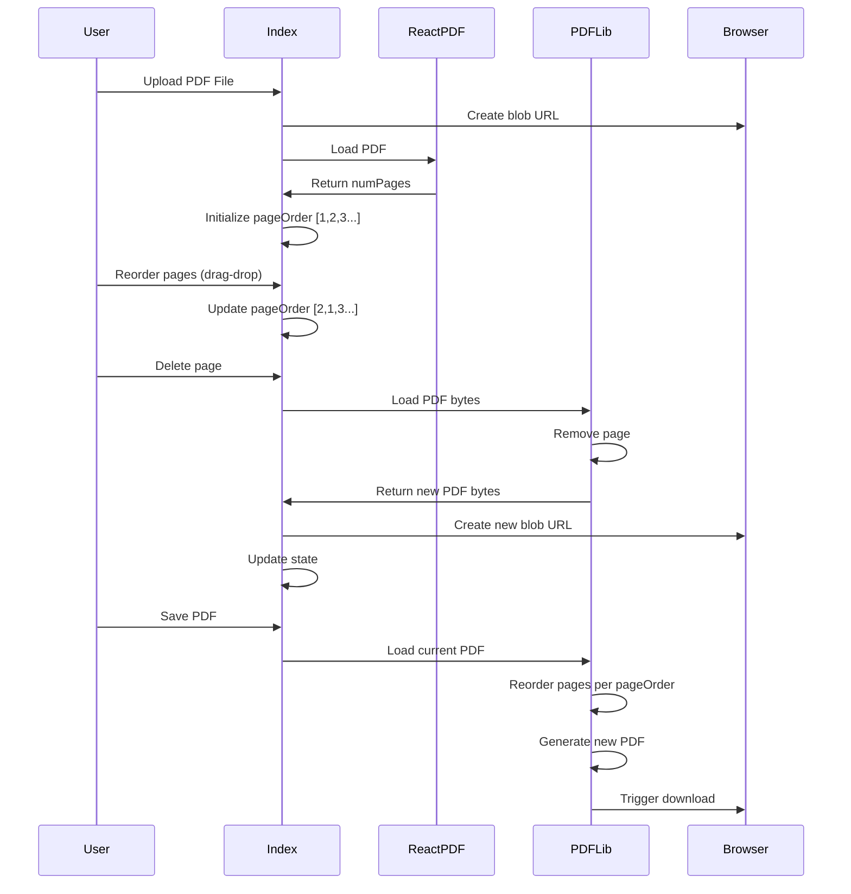

# AGENTS.md - Technical Specification

## Project Overview

**PDF LightView** is a modern, client-side PDF editor built as a Single Page Application (SPA). It provides comprehensive PDF manipulation capabilities entirely in the browser without requiring server-side processing. The application enables users to upload, view, edit, merge, reorder, and save PDF documents with an intuitive drag-and-drop interface.

## Architecture

### High-Level Architecture Diagram



### Component Architecture

#### 1. **Index Page** (`src/pages/Index.jsx`)
- **Role**: Main application container and orchestrator
- **Responsibilities**:
  - PDF file state management
  - Page ordering and manipulation logic
  - Drag and drop handling
  - Save/Save As functionality
  - Merge operations
  - Scroll synchronization between main view and sidebar
  - PDF document loading and rendering coordination

**Key State Variables**:
```javascript
- pdfFile: URL.createObjectURL blob URL for current PDF
- numPages: Total number of pages in PDF
- pdfName: Current PDF filename
- currentPage: Currently visible page number
- pageOrder: Array representing page sequence [1, 2, 3, ...]
- isSaveAsModalOpen: Boolean for Save As dialog
- saveAsFileName: Temporary filename for Save As operation
- isSidebarVisible: Boolean for sidebar visibility
```

**Key Functions**:
- `onFileChange()`: Handles PDF file upload
- `onDocumentLoadSuccess()`: Initializes page order after PDF loads
- `scrollToPage()`: Smooth scroll to specific page
- `onDragEnd()`: Handles page reordering via drag-and-drop
- `onDeletePage()`: Removes page and regenerates PDF
- `onSave()`: Downloads modified PDF
- `onMerge()`: Merges another PDF into current document
- `handleTitleChange()`: Updates PDF name

#### 2. **Navbar Component** (`src/components/Navbar.jsx`)
- **Role**: Top navigation bar with controls
- **Features**:
  - Editable PDF title (click-to-edit with Pen icon)
  - Page counter (current/total)
  - Upload/Change PDF button
  - Merge PDF button
  - Save dropdown (Save/Save As)
  - Sidebar toggle button

**Props Interface**:
```javascript
{
  pdfName: string,
  currentPage: number,
  numPages: number,
  onFileChange: Function,
  onSave: Function,
  onSaveAs: Function,
  onMerge: Function,
  showUploadButton: boolean,
  onTitleChange: Function,
  isSidebarVisible: boolean,
  onToggleSidebar: Function
}
```

#### 3. **PDFSidebar Component** (`src/components/PDFSidebar.jsx`)
- **Role**: Draggable page thumbnail navigation
- **Features**:
  - Page thumbnails with preview
  - Drag-and-drop reordering (react-beautiful-dnd)
  - Delete page button on each thumbnail
  - Click-to-navigate functionality

**Props Interface**:
```javascript
{
  file: string (blob URL),
  pages: Array<number>,
  onPageClick: Function,
  onDragEnd: Function,
  onDeletePage: Function
}
```

#### 4. **DragDropArea Component** (`src/pages/Index.jsx`)
- **Role**: Initial upload interface
- **Features**:
  - Drag-and-drop zone with visual feedback
  - File input button alternative
  - PDF type validation

#### 5. **HelpButton Component** (`src/components/HelpButton.jsx`)
- **Role**: Floating help dialog
- **Features**:
  - Fixed position help button (bottom-right)
  - Dialog with feature list
  - Gradient styling consistent with theme

### Data Flow



### State Management Strategy

**React Built-in State**: The application uses React's `useState` for all state management. No external state management libraries (Redux, Zustand, etc.) are used, keeping the architecture simple and straightforward.

**State Lifting Pattern**: State is managed at the Index component level and passed down to child components via props, following React's unidirectional data flow.

**Ref Usage**: `useRef` is used for:
- `mainContentRef`: Direct DOM access for scroll synchronization

**Side Effects**: `useEffect` hooks handle:
- Scroll event listeners for page tracking
- Cleanup of event listeners
- CurrentPage synchronization on pageOrder changes

## Technology Stack

### Core Framework
| Technology | Version | Purpose |
|------------|---------|---------|
| **React** | ^18.2.0 | UI framework for component-based architecture |
| **Vite** | Latest | Build tool and dev server with HMR |
| **React Router DOM** | ^6.23.1 | Client-side routing (SPA navigation) |

### PDF Libraries
| Technology | Version | Purpose |
|------------|---------|---------|
| **react-pdf** | ^7.7.1 | PDF rendering (uses PDF.js under the hood) |
| **pdf-lib** | ^1.17.1 | PDF manipulation (create, modify, merge) |
| **PDF.js Worker** | CDN | Background PDF parsing (via Cloudflare CDN) |

### UI Framework & Components
| Technology | Version | Purpose |
|------------|---------|---------|
| **Tailwind CSS** | Latest | Utility-first CSS framework |
| **shadcn/ui** | Latest | Pre-built accessible component system |
| **Radix UI** | Various | Headless UI primitives (15+ packages) |
| **Lucide React** | ^0.417.0 | Icon library (tree-shakeable SVG icons) |
| **class-variance-authority** | ^0.7.0 | CVA for component variants |
| **tailwind-merge** | ^2.2.1 | Tailwind class merging utility |
| **tailwindcss-animate** | ^1.0.7 | Animation utilities |

### Drag & Drop
| Technology | Version | Purpose |
|------------|---------|---------|
| **react-beautiful-dnd** | ^13.1.1 | Accessible drag-and-drop for page reordering |

### Form & State Management
| Technology | Version | Purpose |
|------------|---------|---------|
| **React Hook Form** | ^7.52.0 | Form state management |
| **Zod** | ^3.23.8 | Schema validation |
| **@hookform/resolvers** | ^3.6.0 | Form validation integration |
| **@tanstack/react-query** | ^5.48.0 | Server state management (ready for future API integration) |

### UI Enhancement Libraries
| Technology | Version | Purpose |
|------------|---------|---------|
| **Framer Motion** | ^11.3.9 | Animation library |
| **Sonner** | ^1.5.0 | Toast notifications |
| **date-fns** | ^3.6.0 | Date utility library |
| **next-themes** | ^0.3.0 | Theme management (dark/light mode) |

### Build Configuration
- **JavaScript**: ES6+ with Vite bundler
- **Module Resolution**: Path aliases (@/ → src/)
- **Dev Server**: Port 8080, IPv6 support
- **CSS Processing**: PostCSS with Tailwind

## PDF Processing Implementation

### PDF.js Worker Configuration
```javascript
pdfjs.GlobalWorkerOptions.workerSrc = 
  `//cdnjs.cloudflare.com/ajax/libs/pdf.js/${pdfjs.version}/pdf.worker.min.js`;
```
- Uses Cloudflare CDN for PDF.js worker script
- Worker handles PDF parsing in background thread
- Prevents blocking main UI thread during PDF processing

### PDF Manipulation Workflow

**Loading PDF**:
1. File selected via input or drag-drop
2. `URL.createObjectURL()` creates blob URL
3. react-pdf loads and renders PDF
4. `onDocumentLoadSuccess` callback initializes page array

**Reordering Pages**:
1. User drags thumbnail in sidebar
2. `onDragEnd` updates `pageOrder` state
3. No PDF regeneration until save
4. Visual order reflects new arrangement

**Deleting Pages**:
1. User clicks delete button on thumbnail
2. Fetch current PDF as ArrayBuffer
3. Load into pdf-lib PDFDocument
4. Remove page at index
5. Save modified PDF as new blob
6. Update URL and state

**Saving PDF**:
1. Fetch current PDF as ArrayBuffer
2. Create new PDFDocument
3. Copy pages in order specified by `pageOrder`
4. Generate PDF bytes
5. Create download link and trigger

**Merging PDFs**:
1. User selects second PDF file
2. Load both PDFs into pdf-lib
3. Copy all pages from merge PDF
4. Append to existing PDF
5. Save merged result as new blob

## File Structure

```
pdf-lightview/
├── src/
│   ├── components/
│   │   ├── ui/                    # shadcn/ui components (40+ files)
│   │   │   ├── button.jsx
│   │   │   ├── dialog.jsx
│   │   │   ├── input.jsx
│   │   │   ├── dropdown-menu.jsx
│   │   │   ├── use-toast.js
│   │   │   └── ...
│   │   ├── HelpButton.jsx         # Help dialog component
│   │   ├── Navbar.jsx             # Top navigation bar
│   │   └── PDFSidebar.jsx         # Sidebar with thumbnails
│   ├── pages/
│   │   └── Index.jsx              # Main application page
│   ├── lib/
│   │   └── utils.js               # Utility functions (cn helper)
│   ├── App.jsx                    # App root with routing
│   ├── main.jsx                   # React entry point
│   ├── nav-items.jsx              # Route configuration
│   └── index.css                  # Global styles & Tailwind
├── public/                        # Static assets
├── index.html                     # HTML entry point
├── vite.config.js                 # Vite configuration
├── tailwind.config.js             # Tailwind configuration
├── jsconfig.json                  # JavaScript config
├── components.json                # shadcn/ui config
└── package.json                   # Dependencies

```

## Styling System

### Design Tokens (CSS Variables)
The application uses HSL-based CSS custom properties defined in `src/index.css`:
- `--background`, `--foreground`
- `--primary`, `--primary-foreground`
- `--secondary`, `--secondary-foreground`
- `--accent`, `--accent-foreground`
- `--destructive`, `--destructive-foreground`
- `--muted`, `--muted-foreground`
- `--border`, `--input`, `--ring`
- `--radius` (border radius)

### Gradient Theme
Primary gradient: `from-purple-500 to-pink-500`
- Used in Navbar
- Used in Sidebar background
- Used in Help button
- Used in drag-drop area

### Tailwind Configuration
- Custom color system mapped to CSS variables
- Animation utilities (accordion, fade, scale, slide)
- Responsive breakpoints
- Container utilities

## Browser Compatibility

### Requirements
- Modern browser with ES6+ support
- Support for:
  - Blob URLs
  - Web Workers
  - File API
  - ArrayBuffer
  - Canvas API (for PDF rendering)

### Tested Browsers
- Chrome/Edge (Recommended)
- Firefox
- Safari

## Performance Considerations

### Optimization Strategies
1. **Lazy Rendering**: Only visible pages fully rendered
2. **Worker Thread**: PDF parsing doesn't block UI
3. **Blob URLs**: Efficient memory management for PDF data
4. **Tree Shaking**: Vite bundles only used code
5. **Component Splitting**: Modular architecture enables code splitting

### Memory Management
- Blob URLs created for PDF representations
- Previous blob URLs should be revoked (improvement opportunity)
- ArrayBuffers used for PDF bytes (garbage collected)

## Development Workflow

### Setup
```bash
git clone <repository>
cd pdf-lightview
npm install
npm run dev
```

### Build
```bash
npm run build      # Production build to dist/
npm run preview    # Preview production build
```

### File Watching
Vite provides HMR (Hot Module Replacement):
- Component changes reflect instantly
- State preserved during updates
- Fast refresh on save

## Future Enhancement Opportunities

### Technical Improvements
1. **Blob URL Cleanup**: Implement `URL.revokeObjectURL()` to prevent memory leaks
2. **Undo/Redo**: Add command pattern for operation history
3. **Virtual Scrolling**: Improve performance for large PDFs (100+ pages)
4. **Web Worker Pool**: Parallel processing for heavy operations
5. **Progressive Web App**: Add service worker for offline support
6. **IndexedDB Storage**: Cache PDFs locally for resume editing

### Feature Additions
1. **Annotations**: Add text, shapes, highlights
2. **OCR Integration**: Extract text from scanned PDFs
3. **PDF Compression**: Reduce file size
4. **Page Rotation**: Rotate individual pages
5. **Split PDF**: Extract pages into separate documents
6. **Password Protection**: Add/remove PDF encryption
7. **Form Filling**: Edit PDF form fields
8. **Batch Operations**: Process multiple PDFs simultaneously

### Architecture Evolution
1. **State Management Library**: Consider Zustand/Redux for complex state
2. **Backend Integration**: Optional cloud storage/processing
3. **Testing Suite**: Unit tests (Vitest), E2E tests (Playwright)
4. **Error Boundaries**: Graceful error handling
5. **Accessibility Audit**: WCAG 2.1 AA compliance
6. **Internationalization**: Multi-language support

## API Reference

### Index Component API

```typescript
interface IndexProps {}

interface IndexState {
  pdfFile: string | null;
  numPages: number | null;
  pdfName: string;
  currentPage: number;
  pageOrder: number[];
  isSaveAsModalOpen: boolean;
  saveAsFileName: string;
  isSidebarVisible: boolean;
}
```

### Navbar Component API

```typescript
interface NavbarProps {
  pdfName: string;
  currentPage: number;
  numPages: number | null;
  onFileChange: (event: React.ChangeEvent<HTMLInputElement>) => void;
  onSave: () => void;
  onSaveAs: () => void;
  onMerge: (event: React.ChangeEvent<HTMLInputElement>) => void;
  showUploadButton: boolean;
  onTitleChange: (newTitle: string) => void;
  isSidebarVisible: boolean;
  onToggleSidebar: () => void;
}
```

### PDFSidebar Component API

```typescript
interface PDFSidebarProps {
  file: string;
  pages: number[];
  onPageClick: (pageNumber: number) => void;
  onDragEnd: (result: DropResult) => void;
  onDeletePage: (index: number) => void;
}
```

## Security Considerations

### Client-Side Processing
- All PDF processing happens in browser
- No server uploads = no data exposure
- Files never leave user's machine

### Input Validation
- File type checking (application/pdf)
- Error handling for corrupted PDFs
- User alerts for invalid operations

### XSS Prevention
- React escapes rendered content by default
- No `dangerouslySetInnerHTML` usage
- shadcn/ui components are sanitized

## License & Credits

This project uses:
- **PDF.js** (Apache 2.0) by Mozilla
- **pdf-lib** (MIT) by Andrew Dillon
- **shadcn/ui** (MIT) by shadcn
- **Radix UI** (MIT) by WorkOS
- **Lucide Icons** (ISC) by Lucide Contributors

---

**Document Version**: 1.0.0  
**Last Updated**: 2025-10-01  
**Maintained By**: Development Team
