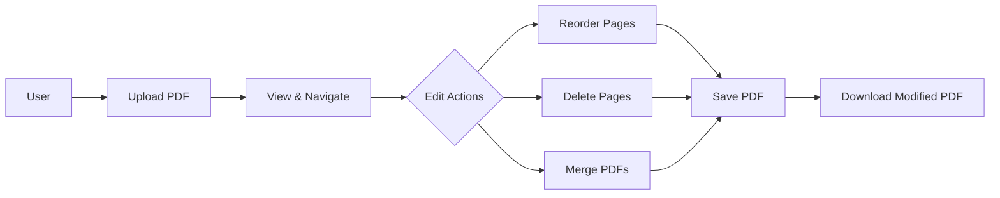

# PDF LightView

A modern, lightweight PDF editor that runs entirely in your browser. Upload, edit, merge, reorder, and save PDF documents without uploading to any server - all processing happens locally for complete privacy.

  

## ✨ Features

- 📤 **Upload PDF Files** - Drag & drop or browse to select
- 👁️ **View PDFs** - High-quality rendering with smooth scrolling
- 🔄 **Reorder Pages** - Drag and drop thumbnails to rearrange pages
- 🗑️ **Delete Pages** - Remove unwanted pages with one click
- 🔗 **Merge PDFs** - Combine multiple PDF files into one
- 💾 **Save & Download** - Export modified PDFs (Save/Save As)
- ✏️ **Rename PDFs** - Edit document names inline
- 🔄 **Change PDFs** - Switch to a different PDF anytime
- 🎨 **Beautiful UI** - Modern gradient design with smooth animations
- 🔒 **100% Private** - All processing happens locally in your browser
- 📱 **Responsive Design** - Works on desktop, tablet, and mobile

## 🚀 Quick Start

### Prerequisites

- **Node.js** (v16 or higher)
- **npm** or **yarn** package manager

### Installation

```bash
# Clone the repository
git clone https://github.com/GPT-Engineer-App/pdf-lightview.git

# Navigate to project directory
cd pdf-lightview

# Install dependencies
npm install

# Start development server
npm run dev
```

The application will be available at `http://localhost:8080`

### Build for Production

```bash
# Create production build
npm run build

# Preview production build locally
npm run preview
```

## 🎯 How to Use

### 1. Upload a PDF
- **Drag & drop** a PDF file onto the upload area, or
- Click **"Choose PDF"** button to browse your files
- Supported format: PDF files only

### 2. View & Navigate
- Scroll through pages in the main viewing area
- Use the **sidebar thumbnails** to jump to specific pages
- Current page indicator shows your position (e.g., "Page 3 of 15")

### 3. Edit Your PDF

#### Reorder Pages
1. Look at the **left sidebar** with page thumbnails
2. **Drag and drop** thumbnails to rearrange pages
3. The main view updates automatically

#### Delete Pages
1. Hover over a thumbnail in the sidebar
2. Click the **red trash icon** in the top-right corner
3. Page is immediately removed

#### Rename Document
1. Click the **PDF name** in the top navbar
2. Edit the name inline
3. Press **Enter** or click outside to save

### 4. Merge PDFs
1. Click **"Merge PDF"** button in the navbar
2. Select another PDF file
3. Pages are appended to the current document

### 5. Save Your Work
1. Click **"Save PDF"** dropdown in navbar
2. Choose:
   - **Save** - Download with current name
   - **Save As** - Enter a new filename

### 6. Additional Features
- **Toggle Sidebar** - Click the panel icon to show/hide thumbnails
- **Change PDF** - Upload a different PDF without refreshing
- **Help Button** - Click the floating help icon for feature list

## 🏗️ Architecture

### Component Structure

```
pdf-lightview/
├── src/
│   ├── pages/
│   │   └── Index.jsx           # Main application container
│   ├── components/
│   │   ├── Navbar.jsx          # Top navigation bar
│   │   ├── PDFSidebar.jsx      # Draggable thumbnail sidebar
│   │   ├── HelpButton.jsx      # Floating help dialog
│   │   └── ui/                 # shadcn/ui component library
│   ├── App.jsx                 # Root component with routing
│   ├── main.jsx                # React entry point
│   └── index.css               # Global styles & design tokens
├── public/                     # Static assets
└── vite.config.js              # Build configuration
```

### Application Flow



### Key Technologies

| Technology | Purpose |
|------------|---------|
| **React 18** | UI component framework |
| **Vite** | Fast build tool & dev server |
| **react-pdf** | PDF rendering engine |
| **pdf-lib** | PDF manipulation & creation |
| **Tailwind CSS** | Utility-first styling |
| **shadcn/ui** | Beautiful UI components |
| **Radix UI** | Accessible component primitives |
| **react-beautiful-dnd** | Drag & drop functionality |
| **Lucide Icons** | Modern icon library |

## 🛠️ Tech Stack

### Frontend Framework
- **React 18.2** - Component-based UI library
- **React Router DOM 6.23** - Client-side routing
- **Vite** - Next-generation build tool with HMR

### PDF Processing
- **react-pdf 7.7.1** - PDF rendering using PDF.js
- **pdf-lib 1.17.1** - PDF creation and manipulation
- **PDF.js Worker** - Background PDF parsing (via CDN)

### UI Framework
- **Tailwind CSS** - Utility-first CSS framework
- **shadcn/ui** - Pre-built component system
- **Radix UI** - Accessible headless components
- **class-variance-authority** - Component variant management
- **tailwind-merge** - Intelligent class merging
- **tailwindcss-animate** - CSS animations

### Additional Libraries
- **react-beautiful-dnd** - Drag and drop for page reordering
- **Lucide React** - SVG icon library (tree-shakeable)
- **Framer Motion** - Animation library
- **Sonner** - Toast notifications
- **React Hook Form** - Form state management
- **Zod** - Schema validation
- **TanStack Query** - Async state management

## 🎨 Design System

### Color Palette
The application uses a purple-to-pink gradient theme:
- **Primary Gradient**: `from-purple-500 to-pink-500`
- **Background**: Light purple/pink gradient `from-purple-100 to-pink-100`
- **Accents**: White overlays with transparency

### Design Tokens
Colors are managed via CSS custom properties (HSL):
```css
--primary: [purple hue]
--secondary: [pink hue]
--accent: [complementary accent]
--background: [light gradient base]
--foreground: [text color]
```

### Component Variants
- **Buttons**: Primary, Secondary, Outline, Ghost, Destructive
- **Inputs**: Default, with error states
- **Dialogs**: Centered modals with backdrop
- **Dropdowns**: Accessible menu components

## 📁 Project Structure

```
pdf-lightview/
├── public/
│   ├── favicon.ico
│   ├── og-image.svg
│   └── placeholder.svg
├── src/
│   ├── components/
│   │   ├── ui/                    # shadcn/ui components (40+ files)
│   │   │   ├── button.jsx
│   │   │   ├── dialog.jsx
│   │   │   ├── input.jsx
│   │   │   ├── dropdown-menu.jsx
│   │   │   └── ... (more components)
│   │   ├── HelpButton.jsx
│   │   ├── Navbar.jsx
│   │   └── PDFSidebar.jsx
│   ├── pages/
│   │   └── Index.jsx              # Main app logic
│   ├── lib/
│   │   └── utils.js               # Helper functions
│   ├── App.jsx                    # Root component
│   ├── main.jsx                   # Entry point
│   ├── nav-items.jsx              # Route configuration
│   └── index.css                  # Global styles
├── .eslintrc.cjs                  # ESLint config
├── .gitignore                     # Git ignore rules
├── components.json                # shadcn/ui config
├── jsconfig.json                  # JS compiler options
├── package.json                   # Dependencies
├── postcss.config.js              # PostCSS config
├── tailwind.config.js             # Tailwind config
├── vite.config.js                 # Vite config
├── AGENTS.md                      # Technical documentation
└── README.md                      # This file
```

## 🔒 Privacy & Security

### Client-Side Processing
All PDF processing happens **entirely in your browser**:
- ✅ No files uploaded to servers
- ✅ No data leaves your machine
- ✅ No tracking or analytics
- ✅ Complete privacy guaranteed

### Secure by Design
- Input validation for PDF file types
- Error handling for corrupted files
- React's built-in XSS protection
- No unsafe HTML rendering

## 🌐 Browser Compatibility

### Supported Browsers
- ✅ **Chrome/Edge** (Recommended) - v90+
- ✅ **Firefox** - v88+
- ✅ **Safari** - v14+
- ✅ **Opera** - v76+

### Required Browser Features
- ES6+ JavaScript support
- Web Workers
- File API & Blob URLs
- Canvas API (for PDF rendering)
- ArrayBuffer support

## 📝 Development

### Available Scripts

```bash
npm run dev          # Start development server (port 8080)
npm run build        # Build for production
npm run preview      # Preview production build
npm run lint         # Run ESLint
```

### Development Server
- **URL**: `http://localhost:8080`
- **Hot Module Replacement**: Enabled
- **IPv6 Support**: Yes (:: binding)

### Environment Setup
```javascript
// Vite configuration includes:
- Path aliases (@/ → src/)
- React Fast Refresh
- Tailwind CSS processing
- Auto-import optimization
```

## 🤝 Contributing

Contributions are welcome! Here's how you can help:

1. **Fork the repository**
2. **Create a feature branch**
   ```bash
   git checkout -b feature/amazing-feature
   ```
3. **Commit your changes**
   ```bash
   git commit -m 'Add amazing feature'
   ```
4. **Push to the branch**
   ```bash
   git push origin feature/amazing-feature
   ```
5. **Open a Pull Request**

### Coding Standards
- Use **ES6+** syntax
- Follow **React best practices**
- Maintain **component modularity**
- Add **PropTypes** or **TypeScript** types
- Write **clean, readable code**
- Include **comments** for complex logic

## 🐛 Known Issues & Limitations

- **Memory Usage**: Large PDFs (100+ pages) may use significant memory
- **File Size**: Very large PDFs (>50MB) may be slow to process
- **Browser Limits**: Some browsers limit blob URL size
- **Mobile Performance**: Complex PDFs may lag on mobile devices

## 🚀 Deployment

### Deploy to Netlify
```bash
npm run build
# Upload dist/ folder to Netlify
```

### Deploy to Vercel
```bash
npm run build
# Upload dist/ folder to Vercel
```

### Deploy to GitHub Pages
```bash
npm run build
# Deploy dist/ folder to gh-pages branch
```

### Deploy via GPT Engineer
Visit [GPT Engineer](https://gptengineer.app/projects/27cfe287-8317-4a6a-99f8-a922c51d0eee/improve) and click **Share → Publish**

## 📄 License

This project is open source and available under the [MIT License](LICENSE).

## 🙏 Acknowledgments

- **Mozilla PDF.js** - PDF rendering engine
- **pdf-lib** - PDF manipulation library
- **shadcn** - Beautiful UI components
- **Radix UI** - Accessible component primitives
- **Tailwind Labs** - Tailwind CSS framework
- **Lucide** - Icon library

## 📞 Support

- **Documentation**: [AGENTS.md](AGENTS.md) for technical details
- **Issues**: [GitHub Issues](https://github.com/GPT-Engineer-App/pdf-lightview/issues)
- **GPT Engineer**: [Project Page](https://gptengineer.app/projects/27cfe287-8317-4a6a-99f8-a922c51d0eee/improve)

## 🌟 Star History

If you find this project useful, please consider giving it a star ⭐

---

**Built with ❤️ using React, Vite, and Tailwind CSS**

**Version**: 1.0.0  
**Last Updated**: 2025-10-01
